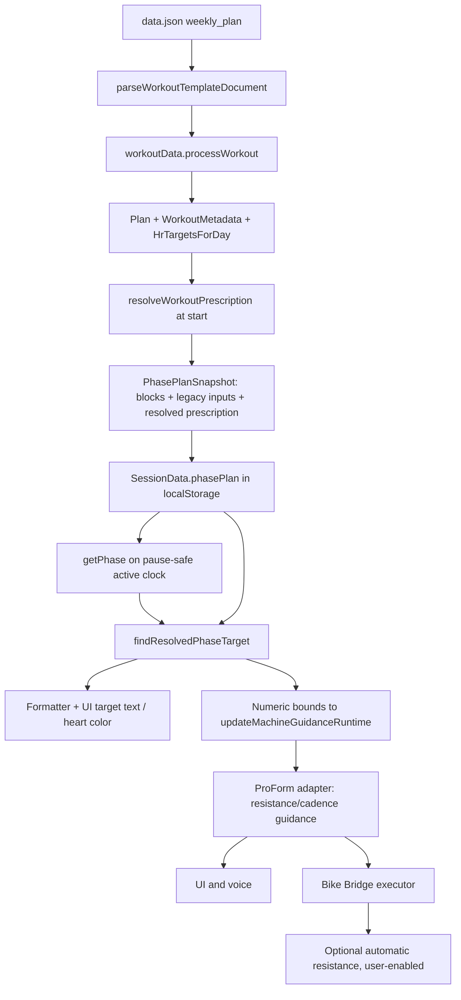
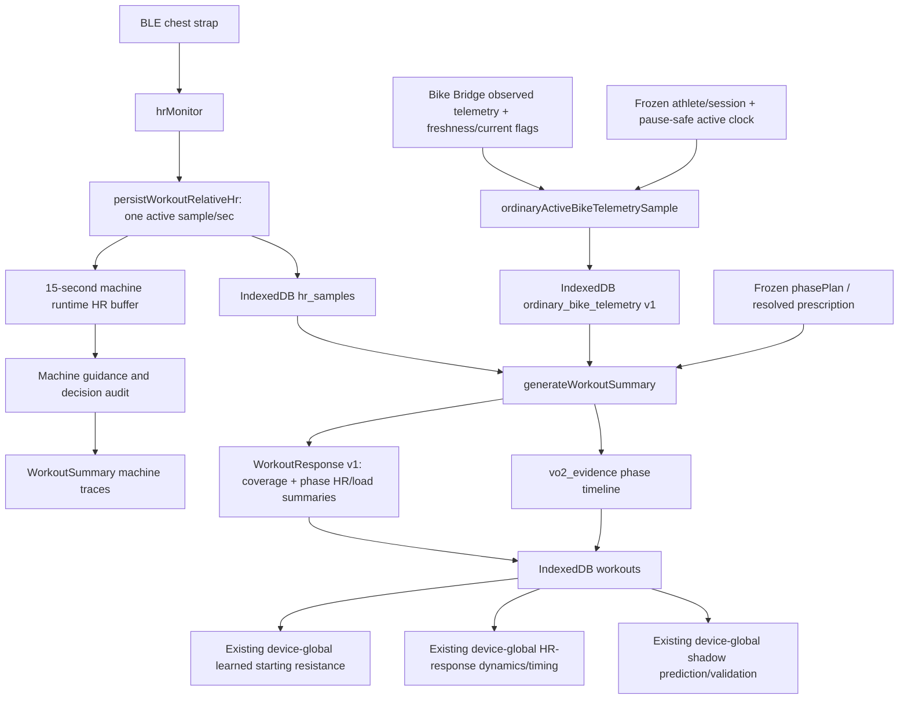
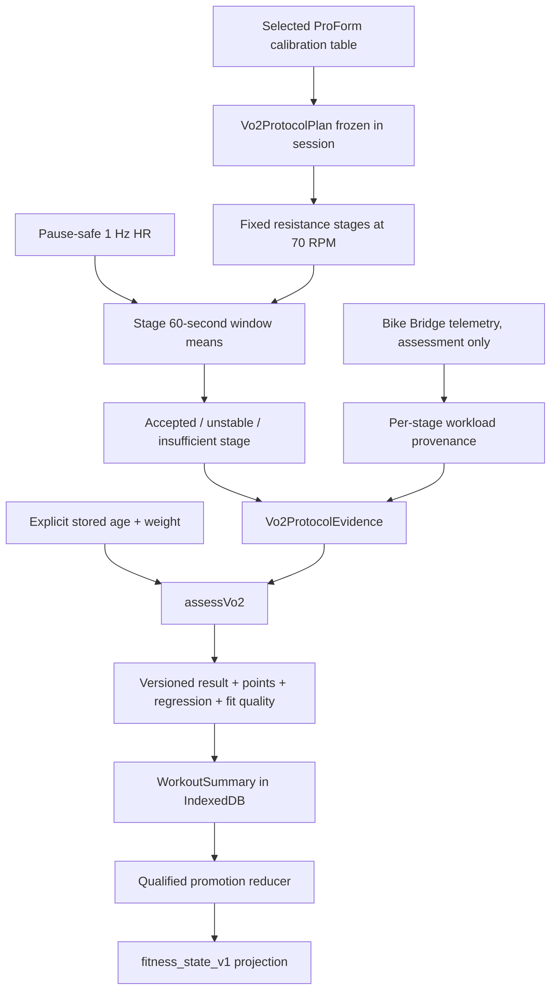

# Adaptive Training Architecture Review

## 1. Executive Summary

The seven-day plan is not physiologically personalized today. Its ordinary workouts load absolute BPM strings from `data.json`; the values do not depend on age, weight, resting heart rate, HRmax, VO₂ max, prior workouts, or the selected athlete. This confirms the fixed-target concern. The standalone VO₂ assessment is a separate workload-led protocol and intentionally shows no HR target, but it also starts from the same machine-calibrated workloads for every user and has no authoritative HRmax with which to enforce an automatic submaximal ceiling.

The codebase is nevertheless much closer to an adaptive system than the plan format suggests. It already has a pause-safe active clock, stable phase identities, a frozen session plan, per-second workout HR, phase-level evidence, a versioned VO₂ protocol and estimator, machine-specific resistance/cadence guidance, bounded live HR-driven resistance changes, learned starting resistance, learned HR-response timing, decision audits, and shadow-only dose prediction/validation. The current system therefore contains a capable **execution and observation layer**, but its controller is optimizing against the wrong upstream object: a fixed population-level BPM range.

The recommended direction is evolutionary:

1. Keep `data.json` as the workout-template source and preserve workout `intent`, activity, phase kind, duration, interval structure, pause-safe timing, and the machine-adapter boundary.
2. Build on the now-implemented relative phase intensity and frozen, versioned `ResolvedWorkoutPrescription` seam; keep its historical resolver formats readable as newer resolvers ship.
3. Build on the now-implemented internal athlete/fitness model, qualified VO₂ calibration promotion, normalized ordinary-workout response, and conservative passive workload observation inside a fixed narrow HR window; do not add multi-profile UI or a readiness score yet.
4. Treat workload as the primary prescription for hard bike intervals when reliable watts/calibration exists; treat HR as expected response and a bounded guardrail. Continue to use HR more directly for longer steady work where lag is less problematic.
5. Keep the Phase D observation descriptive and ineligible for prescription; it is not HR-normalized fitness evidence and must not silently become an input to Phase E.

The largest technical risks are:

- historical/legacy workouts still lack workload traces, while new ordinary evidence depends on Bike Bridge availability and can add roughly 1–3 MB of retained raw telemetry per workout hour;
- the app has no resting HR, observed HRmax, persisted HRV baseline, or validated ordinary-workout HR/workload slope; formal VO₂ remains authoritative while ordinary workouts support only a descriptive workload observation inside a fixed narrow HR window;
- existing automatic resistance control can act on fixed BPM targets, so changing target generation changes a real controller, not just display text;
- machine learning is device-global and keyed by machine/intent/duration, not by athlete, which is unsafe for future shared-device profiles;
- several confidence concepts exist, but they are specific to separate subsystems rather than a unified provenance model.

### Implementation status (Phase A)

Phase A has now been implemented as a behavior-preserving prescription seam. `data.json` retains every legacy `target_hr_bpm` value and adds semantic `intensity_id` values. `src/workoutTemplate.ts` validates the active template, while `src/workoutPrescription.ts` resolves the legacy values once into a versioned `ResolvedWorkoutPrescription`. `beginWorkout` freezes that result inside the existing `PhasePlanSnapshot`; the workout UI, heart-zone coloring, machine-guidance input, VO₂ evidence, and workout summary consume the same structured phase target. Historical session snapshots without the new field remain readable and are resolved only from strictly sanitized frozen legacy inputs. If both persisted representations are invalid, restoration supplies no HR target and does not fall back to the current live plan. Phase A itself did **not** personalize or otherwise change any BPM range and did not change the standalone VO₂ protocol.

### Implementation status (Phase B)

Phase B is now implemented. `src/profile.ts` migrates the legacy single-user form into a versioned `AthleteProfile` under `athlete_profile_v1`; a separate `athlete_identity_v1` record and recoverable canonical-envelope identity prevent malformed demographics or metric provenance from silently rotating the athlete owner. The profile preserves pounds/inches for lossless UI compatibility, keeps blank/default values absent, and retains unchanged user-entered VO₂ observation provenance across unrelated edits. User-entered VO₂ remains only `source: user_entered`, `quality: unverified`. `src/fitnessState.ts` provides strict parsing and local persistence under `fitness_state_v1`, plus a pure, fail-closed formal-assessment promotion reducer. Its persisted v1 reader is pinned to permanent estimator/protocol identities rather than current writer aliases, while historical v1 promotion re-verifies evidence with explicitly version-bound v1 formulas and thresholds. Qualified assessments retain exact VO₂, predicted—not measured—maximal watts, eligible HR/watt points, regression diagnostics, workload provenance, the actual validated estimator/protocol versions, evidence session ID, timestamps, and conservative quality; rejected stages and demographic predicted HRmax are not promoted as observed facts. New sessions and summaries carry the stable athlete owner and a minimal athlete/fitness version snapshot, while legacy history remains readable and unmodified. Summary persistence occurs before the derived projection update, and projection failure cannot prevent history storage. The Phase A legacy resolver remains authoritative: seven-day targets and machine-guidance behavior are unchanged. Machine-learning/dynamics stores remain device-global and require a dedicated athlete-scoping phase before multi-profile UI.

### Implementation status (Phase C)

Phase C is now implemented without changing prescription or control behavior. Successful ordinary bike sessions write strict v1 telemetry rows to the IndexedDB `ordinary_bike_telemetry` store at the existing pause-safe active-second cadence. Each row uses the athlete/session frozen at workout start, records fresh measured watts/cadence/observed resistance separately from desired/commanded resistance, and records stale/unavailable seconds without carrying their machine values forward. Finalization flushes pending rows and derives a strict v1 `WorkoutResponse` from existing canonical HR, the raw bike trace, frozen blocks, and the frozen `ResolvedWorkoutPrescription`; current profile and live template data are not consulted for ownership or segmentation. The response retains completion, independent HR quality and fresh-transport-row coverage, workload provenance, and stable per-phase/interval summaries. Insufficient machine evidence produces an explicit HR-only/partial response rather than zero workload. Raw telemetry for a successfully summarized workout remains for audit until that workout is deleted. Restarting or replacing an unfinalized session flushes and deletes its ordinary trace immediately; any other abandoned trace becomes eligible for indexed cleanup after 48 hours only when no immutable summary owns it. The standalone VO₂ collector/estimator remains separate and unchanged, and existing machine learning remains legacy device-global.

### Implementation status (Phase D)

Phase D is implemented as a conservative athlete-owned `descriptive_workload_trend_in_fixed_hr_window`, not an HR-normalized fitness improvement, absolute VO₂ estimate, or generic fitness score. `src/fitnessRefinement.ts` strictly re-parses owned Phase C responses, accepts only completed ordinary bike `aerobic_base` or `threshold` work with at least 480 planned and 480 completed active seconds, and requires session and phase HR/load coverage, fresh bike coverage, stable plausible watts/HR/cadence, and observed measured or calibrated watts. Mixed workload provenance, short VO₂ intervals, recovery, warm-up/cooldown, strength/elliptical activity, cancellation, controller resistance, stale/missing load, and malformed/unowned history fail closed. Four measured sessions on four dates are required; any calibrated-watt evidence raises the requirement to five sessions and keeps quality low.

The corrected deterministic `fitness-refinement-v2` reducer assigns each qualifying phase median to a fixed 2 BPM half-open window before session aggregation. Only same-intensity phases inside the same window may be duration-weighted together, so cross-window phases cannot manufacture a representative HR that neither phase supported. One session contributes at most one aggregated observation to any candidate window. The reducer selects the first window to independently qualify in chronological history, de-duplicates session IDs, uses an initial baseline workload median plus a four-session rolling candidate median, caps upward movement at 1.5% per added session, and permits at most a 0.75% decline only after three consecutive observations are more than 2% below the guarded trend. Persisted workload extrema, baseline, guarded trend, and median absolute deviation are all rounded into one canonical three-decimal representation before range checks, percentage derivation, and quality classification. Quality is transparent `low`/`moderate`/`high`, based on independent-session volume, measured provenance, and median absolute workload dispersion. Fitness-state schema v3 uses Phase-D-specific bounded provenance: total evidence count, independent-date count, time range, first/latest IDs, up to 16 recent IDs, and a deterministic digest. The state remains fully rebuildable from immutable summaries without growing indefinitely. Rebuilds run after durable save and deletion; `updatedAt` is always the maximum timestamp of metrics that remain, so removed evidence cannot leave a stale watermark.

Formal assessment fields remain unchanged and authoritative. Ordinary evidence at or before the latest formal anchor is excluded, and the passive metric remains `source: workout_observation`, `interpretation: descriptive_observation_only`, `normalizedToReferenceHr: false`, and `eligibleForPrescription: false`; it never becomes or overwrites `formal_assessment`. The permanent schema-v2 reader remains pinned to the historical `fitness-refinement-v1` contract and rejects malformed or forged records, while the current schema-v3 reader is pinned to `fitness-refinement-v2`. Historical v1 passive trends remain readable for storage compatibility but are quarantined from the effective projection because their 10 BPM clustering cannot establish equal-HR comparability. Current profile demographics and legacy device-global learned resistance, HR dynamics, and shadow prediction never enter the reducer. Phase D does not infer VO₂, HRmax, recovery, drift, readiness, illness, sleep, HRV, temperature, or acute fatigue, and it does not change prescriptions or machine behavior.

### Implementation status (Phase E1)

The Phase E design gate is complete and E1 shadow infrastructure is implemented, but personalized control remains inactive. `personalized-prescription-resolver@1` is a pure, deterministic diagnostic resolver with a permanent strict schema-v1 reader. At workout start it freezes the current profile inputs, the full formal HR/workload calibration and points, quality, algorithm/protocol identities, workload provenance, evidence session IDs, timestamps, explicit characterization policy, per-phase legacy HR bounds, structured safety checks, outcome, and finite fallback reason. The record is stored additively as `PhasePlanSnapshot.shadowPrescriptionEvaluation` and copied unchanged into `WorkoutSummary.shadow_prescription_evaluation`; it is never recomputed on render, phase transition, resume, finalization, or passive rebuild. Historical snapshots and summaries do not require the field, and malformed or future shadow schemas are ignored without invalidating a valid legacy prescription.

E1 can produce a descriptive candidate power band only for ordinary bike `work` phases with `aerobic_base` or `threshold` semantics, including the aerobic-volume workout's `aerobic_base` work phase. It inverts the supported formal calibration only when both legacy HR endpoints and both rounded power endpoints remain inside the actual observed assessment domains. No extrapolation or clamping is permitted. The production shadow policy intentionally has no activation-approved assessment lifetime; freshness is recorded as not evaluated and every evaluation has `activationEligible: false`. User-entered VO₂, passive observations, predicted max watts, demographic predicted HRmax, height, sex, and HRV do not drive candidate math. The active resolver remains `legacy-hr-target-resolver@1`; UI HR targets, controller inputs, resistance behavior, workout selection, and durations are unchanged. E2 characterization remains the next phase.

Throughout this review:

- **Current** means directly implemented in active `src/` code or `data.json`.
- **Inferable** means derivable from data already retained without claiming more physiological validity than the data supports.
- **Proposed** means new architecture.
- **Uncertain** means a product or exercise-physiology decision that the repository does not resolve.

## 2. Current Architecture

### Active application and build path

`index.html` loads `./dist/main.js`. The maintainable source is TypeScript under `src/`; `npm run build` compiles it to `dist/`. Native builds use `scripts/build-native.mjs`, which bundles `src/main.ts` and copies `index.html`, `data.json`, and static assets into `www/`; Capacitor is configured with `webDir: "www"` in `capacitor.config.ts`. The root-level files such as `workout-data.js`, `workout-logic.js`, and `profile.js` are older non-module implementations and are not loaded by the current `index.html`. They should be treated as stale duplicates, not an alternative active runtime.

`src/main.ts::bootstrap` registers the browser-facing module globals, loads the profile, removes stale sessions, calls `initializeWorkoutPlan`, starts Bike Bridge polling, and runs `updateDisplay` every second.

### Workout definitions

The seven-day plan is JSON in `data.json` under `weekly_plan`. Each day can contain:

- `day`, `type`, top-level `intent`, and allowed `activities`;
- `warmup` and `cooldown` with `duration_min`, semantic `intensity_id`, and legacy `target_hr_bpm`;
- a continuous `main_set` with `duration_min`, `phase_kind`, `intensity_id`, and `target_hr_bpm`; or
- an interval `main_set` with `repetitions` or `is_sequence` and phases containing `phase`, `kind`, `duration_min`, `intensity_id`, and `target_hr_bpm`.

Friday contains two variants. `src/workoutData.ts::getSelectedVariant` rotates them by week from a fixed 2024-01-01 epoch. Duration strings such as `"60–75"` are passed through `parseWorkoutDuration`, which takes only the leading integer; Tuesday is therefore 60 minutes, Wednesday 20, Thursday 20, Saturday 90, and Sunday 30 in the runtime.

`src/workoutData.ts::transformWorkoutData` and `processWorkout` normalize the JSON into three module-level maps:

- `Plan`: `{ warm, sustain, cool }` minutes;
- `WorkoutMetadata`: `{ type, intent, activities }`;
- `HrTargetsForDay`: warm-up, optional warm-up subsections, main-set, cooldown, and normalized interval phases.

The normalized types live in `src/types.ts`. `src/workoutTemplate.ts::parseWorkoutTemplateDocument` now performs a deliberately small runtime validation pass over kinds, semantic intensity IDs, durations, repetitions, activities, and legacy target value types before `transformWorkoutData` runs.

The standalone VO₂ assessment is not in `data.json`. `src/workoutData.ts::installStandaloneVo2Workout` inserts `VO2MaxEstimation` using `src/vo2Protocol.ts::vo2PlanBlocks` and `vo2WorkoutMetadata` after the weekly JSON loads.

### Workout runtime

`src/workoutLogic.ts::startWorkout` resolves the allowed activity and calls `beginWorkout`. `beginWorkout`:

- creates a session ID;
- resolves the legacy HR definitions through the pure, versioned `resolveWorkoutPrescription` and snapshots that result with the block lengths and HR target structure through `capturePhasePlanSnapshot`;
- persists session state through `src/sessionStore.ts::startSession`;
- creates and persists a `Vo2ProtocolRuntime` for the standalone assessment;
- resets the in-memory machine-guidance runtime.

`SessionData.phasePlan` is important existing architecture. It now freezes `{ blocks, hrTargets, resolvedPrescription }` so an in-progress workout, UI, controller inputs, and final evidence do not silently change if live workout data changes. Restoration retains explicit support for historical legacy-resolver v1 prescriptions and strictly reconstructs both the resolved object and the normalized `HrTargetsForDay` fallback. The fallback parser validates target bounds, intensity IDs, phase kinds, subsection timing, interval structure, repetitions, and consistency with frozen blocks. Older snapshots without `resolvedPrescription` remain readable only when those frozen legacy inputs pass; if both representations fail, the existing phase plan remains present with `hrTargets: null`, preventing lookup from consulting the current live plan and leaving machine guidance without an HR target. Pause/resume state is also persisted per selected day. `actualElapsedSeconds` is the authoritative active clock; `resumeSession` rewrites the start time so elapsed time excludes pause wall time.

`src/workoutLogic.ts::getPhase` owns ordinary phase progression. It emits stable `WorkoutPhaseState` values with `kind`, `phaseId`, phase-relative time, duration, detail name, and interval index. Repeated intervals receive IDs such as `cycle:2:0`; sequence phases receive `sequence:3`. The standalone assessment delegates phase progression to `getVo2ProtocolPhase` instead.

`src/uiControls.ts::deriveWorkoutState` obtains the session snapshot, calls `getPhase`, and selects the matching frozen `ResolvedWorkoutPhaseTarget` with `findResolvedPhaseTarget`. `renderWorkout` formats its presentation metadata into `#hrTarget`, uses its numeric `expectedHeartRate` for heart coloring, and passes those same numeric bounds into `updateMachineGuidanceRuntime`. It does not parse rendered text. Warm-up subsection labels and targets now come from the frozen prescription, so a live plan reinitialization or Friday variant change cannot alter the running workout's label or target.

### Heart-rate targets and machine guidance

For ordinary workouts, `src/workoutPrescription.ts::resolveWorkoutPrescription` converts legacy strings such as `130–140`, `≥160 (cap 170)`, and `<120` into structured numeric bounds at workout start. The single-number fallback remains ±5 BPM, and an uncapped `≥N` remains capped at 200 for exact behavioral compatibility. Original target notation is retained separately as `displayTargetHrBpm`; `formatResolvedHeartRateTarget` renders it without making presentation text authoritative. The arrow strings used as Friday's parent warm-up labels are superseded by subsections while those subsections cover the warm-up. `workoutLogic.hrTargetText` and its parser export remain compatibility utilities for older callers/tests, not the active UI/controller data path.

Targets have two effects:

1. They are informational/coaching inputs: text display, heart color, voice/phase context, evidence, and summary metadata.
2. On a selected ProForm SMART Power 10.0, they are controller inputs. `src/uiControls.ts::renderWorkout` passes the range to `src/machines/runtime.ts::updateMachineGuidanceRuntime`, which calls the machine adapter in `src/machines/proformSmartPower10.ts`.

The machine adapter recommends resistance and cadence and may automatically send resistance through the Bike Bridge if the user has explicitly enabled automatic control. `src/platform/bikeBridgeConfig.ts` defaults `automaticControlEnabled` to `false`; `src/platform/bikeBridgeRuntime.ts` is the executor and transport, not the decision-maker.

Current ProForm policy is deterministic and bounded:

- warm-up uses fixed progressive resistance/cadence thirds;
- recovery starts at resistance 2 / 63 RPM and may decrease when recovery HR stays high;
- work targets 70 RPM and starts from a duration-based default or a learned starting resistance;
- a qualified rolling HR median requires at least five distinct samples spanning at least four seconds;
- HR at least 3 BPM above the target causes a one-level decrease when allowed;
- HR at least 3 BPM below causes a one-level increase, with a 5 BPM deficit required at resistance 13+;
- automatic guidance is clamped to resistance 1–15;
- short intervals adjust the next repetition, medium intervals adjust at most once, and long intervals use evaluation cooldowns.

The current architecture already separates the template, phase runtime, machine recommendation, and Bike Bridge actuation. It does **not** yet separate a relative physiological prescription from its resolved per-athlete target.

### User/profile data

`src/types.ts::AthleteProfile` is the canonical versioned record for the one local athlete. `src/profile.ts::loadAthleteProfile` reads `athlete_profile_v1` or idempotently migrates the legacy `profile` object, generating one opaque stable UUID and retaining the legacy record. There is still no account, multiple-profile collection, selected-profile pointer, or profile-switching UI.

The UI in `index.html` still calls this area “Profile” and remains a single settings form. Weight is entered and canonically retained in pounds; height remains total inches, avoiding a lossy or repeatable unit migration. Age and a male/female/blank sex field are stored. Optional user-entered VO₂ becomes an unverified provenance-bearing metric on `AthleteProfile`; it does not overwrite formal-assessment `FitnessState`. Sex, height, and user-entered VO₂ have no effect on workout prescription or the VO₂ estimator.

`BLANK_PROFILE` deliberately uses empty strings. Migration and `parseExplicitVo2ProfileInputs` retain only explicit values inside the estimator's supported age/body-mass bounds and convert pounds to kilograms only at the estimator boundary. Blank, partial, malformed, and placeholder-looking legacy fields remain absent. The legacy `profile` key is retained as a compatibility mirror but is no longer authoritative after successful migration.

Equipment and learned machine state are separate global local-storage records:

- `sisu_trainer_equipment_selection` (`src/machines/selection.ts`);
- `sisu_trainer_bike_bridge` (`src/platform/bikeBridgeConfig.ts`);
- `sisu_trainer_machine_learning` (`src/machines/learning/types.ts`);
- `sisu_trainer_hr_dynamics` (`src/machines/dynamics/types.ts`);
- `sisu_trainer_shadow_resistance_predictions` (`src/machines/prediction/types.ts`).

This separation is sound for equipment configuration, but learned physiological response is currently device-global rather than athlete-owned.

### VO₂ assessment

The active assessment is the versioned `bike-submax-70rpm` protocol in `src/vo2Protocol.ts`, with estimation in `src/vo2Estimator.ts`. Earlier generic `vo2_evidence` support remains active for all workouts; it is not a competing estimator. The root legacy JavaScript is inactive.

Protocol v1 requires a fresh chest-strap HR signal and the selected ProForm calibration profile. It does **not** require age/weight at preflight even though the final estimate does. The current calibration table in `src/machines/proformSmartPower10.ts::estimatedWattsAt70Rpm` resolves to:

- five-minute warm-up at resistance 1 / approximately 66 W / 70 RPM;
- stage 1 at resistance 6 / approximately 86 W;
- stage 2 at resistance 8 / approximately 108 W;
- stage 3 at resistance 10 / approximately 123 W;
- five-minute cooldown at the warm-up load.

The planner requests roughly +25 W steps but chooses the nearest unused calibrated resistance above the previous workload. Protocol v1 caps itself at resistance 10 and therefore currently resolves three work stages, even though the runtime supports up to four.

Each stage is nominally three active minutes and may extend to four or five. `evaluateStageHr` compares two consecutive 60-second windows, requires at least 45 samples in each, and accepts the stage when the mean difference is at most 5 BPM. At five minutes an unsteady or sparsely sampled stage is rejected. Pause stops protocol advancement because the same active clock is used for phase, HR, and telemetry.

The protocol holds prescribed resistance/cadence; it does not use the normal HR target controller. The user can choose “Limit Reached” or early cooldown. Although termination reason names include `submax_hr_ceiling` and `hr_lost`, protocol v1 has no authoritative HRmax and does not currently execute automatic HR-ceiling termination. `authoritativeHrMaxBpm` returns `undefined`, and evidence records `automatic_submax_hr_ceiling_available: false`.

Bike Bridge connectivity/automatic control is not required by preflight. That is useful for manual execution, but without measured watts or enough measured cadence the final workload source remains `prescribed_only` and the estimator rejects the stages as unverified. A user can therefore finish the protocol yet receive an insufficient-evidence result.

At finalization, `src/workoutSummary.ts::generateWorkoutSummary` builds protocol evidence and calls `assessVo2` only for the standalone selector. The estimator:

- requires explicit valid age (10–100) and weight (20–250 kg);
- considers only protocol-accepted stages;
- requires performed workload to be verified by measured watts or by measured cadence near 70 RPM plus the calibration table;
- requires at least three accepted and eligible stages;
- requires stage HR at least 110 BPM and below 85% of Tanaka age-predicted HRmax;
- requires strictly increasing workload and HR;
- fits HR as a linear function of watts and requires R² at least 0.7;
- extrapolates to predicted HRmax and applies the ACSM cycle equation.

The result retains much more than `VO2Max = N`: accepted/eligible points, per-point steady-state HR and workload provenance, slope, intercept, R², predicted HRmax, predicted maximal watts, profile snapshot, reason codes, stage counts, estimator/protocol versions, and a high/moderate/low fit-quality label. The immutable result remains in its workout summary. After that summary is saved, a supported `estimated` result can update the current `FitnessState`; the reducer revalidates and recomputes its eligible-point regression, retains only eligible points, labels maximal watts as predicted, and keeps demographic HRmax inside calibration audit metadata rather than promoting observed HRmax. Ordinary workout prescriptions still do not consume this state; Phase D only adds a separate non-prescriptive trend.

### Telemetry and workout history

Chest-strap HR enters through `src/hrMonitor.ts`. `src/uiControls.ts::persistWorkoutRelativeHr` records at most one sample per active second, ignores pause-era HR, feeds the machine runtime's 15-second buffer, and writes `{ session_id, timestamp_sec, hr }` to IndexedDB.

Bike Bridge polls roughly once per second and exposes observed resistance, RPM, watts, per-metric `current` flags, a bridge snapshot identity, local receive time, and transport staleness. The VO₂-only `recordVo2BikeTelemetryIfActive` path remains unchanged: assessment telemetry is held under `bike_telemetry_<sessionId>` in local storage/memory, summarized into stage workload evidence, then deleted after successful or cancelled finalization. For an owned ordinary bike session, `recordOrdinaryBikeTelemetryIfActive` instead uses `ordinaryActiveBikeTelemetrySample` and writes at most one versioned IndexedDB row per active second. A repeated bridge snapshot is deduplicated across seconds; a fresh observation may upgrade same-second unavailable/stale evidence, but later callbacks cannot overwrite an already-fresh row.

`src/machines/runtime.ts` retains in memory and then places in `WorkoutSummary`:

- a change-only `machine_guidance_trace` containing recommended resistance, cadence, optional estimated watts, phase identity, and target HR;
- a bounded `machine_decision_audit` containing work starts, evaluations (including hold), representative HR, constraints/reasons, and deferred evaluations.

These describe the controller's recommendation and decision, not confirmed physical workload. Bike Bridge command acceptance and observed telemetry are not included.

`src/vo2Evidence.ts::buildVo2Evidence` runs for ordinary and assessment workouts despite the name. It persists the pause-safe phase timeline, frozen prescribed HR, active duration, total paused duration, work/cooldown markers, early-cooldown/cancel status, HR sample coverage, and machine provenance. Full per-second HR remains in IndexedDB; the summary's `hr_trace` is only one sample per minute.

Two qualifications matter for later analytics:

- after a cancelled workout is summarized, `restartWorkout` clears that session's raw HR samples and ordinary bike telemetry, so cancelled history retains only the summary/downsampled trace and derived response; replacing an unfinalized session likewise flushes and deletes only the replaced session's ordinary trace;
- `WorkoutSummary.duration_minutes` is wall-clock duration, while HR and `vo2_evidence.active_duration_sec` use active time. If zone minutes do not equal wall duration, `generateWorkoutSummary` adds the difference to the primary zone. Paused time can therefore inflate zone/stress summaries, making them unsuitable as-is for training-load or readiness calculations.

IndexedDB schema version 3 in `src/workoutStorage.ts` has:

- `workouts`, keyed by `session_id`, with indexes on `startedAt` and `day`; each row wraps the full summary;
- `hr_samples`, keyed by `[session_id, timestamp_sec]`, indexed by `session_id`;
- `ordinary_bike_telemetry`, keyed by `[session_id, active_sec]`, with session, observation-time, and session/source-snapshot indexes;
- `sisu_settings`, keyed by `key`.

Versioned local-storage records provide the single `AthleteProfile` and current `FitnessState`; new session/summary evidence carries `athlete_id` plus a minimal version pointer. Historical IndexedDB rows are not rewritten and may omit both fields. New owned ordinary bike summaries may contain a strict `workout_response`; malformed persisted responses are omitted when history is read. Workout deletion removes the summary, HR, and only that session's ordinary telemetry in one IndexedDB transaction, then rebuilds the passive projection from remaining summaries without touching formal assessment evidence. SISU export strips local athlete/snapshot fields, activity, machine traces/audits, shadow fields, VO₂ evidence/assessment, resolved prescription, and `workout_response`.

The frozen session/VO₂ runtime survives reload, but machine-guidance runtime, its recent HR buffer, trace, and in-progress decision-audit state are memory-only. A mid-workout reload resets that controller history, so the final trace/audit can be incomplete and learned behavior may restart within the same nominal session. Any future adaptive authority needs an explicit recovery policy or persisted controller snapshot.

HRV is live-only. `src/platform/hrvSession.ts` and `hrvAccumulator.ts` calculate rolling RMSSD with artifact/continuity/reliability metadata, but no baseline or daily observation is persisted. `getTodayHRV`, SISU HRV sync, and HRV-based block adjustment currently return no adaptation/identity behavior.

## 3. Current Data Flow

### Ordinary workout prescription and execution



### Telemetry, completion, and learning



### Standalone VO₂ assessment



## 4. Hard-Coded Target Audit

### Active seven-day prescriptions

All targets below come from `data.json` and are absolute hard-coded physiological prescriptions. Friday A/B is week rotation, not athlete personalization.

| Workout | Active fixed prescription |
| --- | --- |
| Monday | warm-up 130–140; hard ≥160 with cap 170; recovery 120–135; cooldown <120 |
| Tuesday | warm-up 110–120; main 115–130; cooldown <115 |
| Wednesday | warm-up 100–115; main 100–160; cooldown <105 |
| Thursday | warm-up 135–145; main 155–162; cooldown <120 |
| Friday A | warm-up subsections 105–120, 120–130, 130–140, 140–150; work 158–162, 160–165, 165–170, 168–172; recoveries 120–135; cooldown <115 |
| Friday B | warm-up subsections 110–130 and 130–145; work 160–170; recovery 120–135; cooldown <115 |
| Saturday | warm-up 110–120; main 115–130; cooldown <115 |
| Sunday | warm-up <110; recovery main <115; cooldown <105 |

### Classification of other BPM-related values

| Source | Classification | Effect |
| --- | --- | --- |
| `src/workoutPrescription.ts::parseLegacyHeartRateTarget` | resolver-only fallback interpretation | Converts legacy template values to frozen numeric bounds; a single number becomes ±5 BPM. The controller does not parse UI text. |
| `src/zoneCalculator.ts` absolute zone boundaries | fixed summary classification | Maps HR to zones 1–5. It is not a prescription, but summary/stress labels are also one-size-fits-all. |
| `src/machines/proformSmartPower10.ts` ±3 BPM and R13+ 5 BPM deficit | dynamic controller margin | Dynamic relative to the active range, but the range itself is fixed. |
| `src/vo2Protocol.ts` ≤5 BPM window delta | assessment stability rule | Determines steady state; not a training target. |
| `src/vo2Estimator.ts` ≥110 and <85% predicted HRmax | age-based estimator eligibility | Filters assessment points; it neither displays nor controls a workout target. |
| `src/vo2Estimator.ts::predictedHrMaxBpm` | age-based calculation | Used for estimator validity/extrapolation only. |
| `src/vo2Protocol.ts::authoritativeHrMaxBpm` | unavailable placeholder | Returns `undefined`; no observed/authoritative HRmax control exists. |
| `src/downregulation/*` HR mappings | UI/audio visualization mapping | Not part of the seven-day training prescription. |
| `tests/*.test.mjs` target ranges | test fixtures | Characterize parsing/controller/evidence; not production prescriptions. |
| `dist/*` | generated copies | Built output of `src`, not independent definitions. |
| root `workout-*.js`, `zone-calculator.js` | stale legacy copies | Not loaded by current `index.html`. They duplicate older fixed behavior and should not be modified as the source of truth. |

**Answer:** yes. The current seven-day workouts effectively prescribe the same HR ranges to everyone. Personalization today changes selected activity, starting resistance, resistance during/after work, and controller timing for a configured ProForm; it does not change the prescribed BPM range. Age, weight, stored VO₂, sex, height, assessment result, and workout history do not resolve ordinary workout targets.

The fixed values are not merely UI copy. They enter at `data.json` → validated template/`processWorkout` → `resolveWorkoutPrescription` → frozen `SessionData.phasePlan.resolvedPrescription` → numeric `expectedHeartRate` → `updateMachineGuidanceRuntime`, so they can influence automatically commanded resistance when opt-in control is enabled. The legacy string is presentation/provenance data after resolution, not a controller input.

## 5. Existing Personalization Capabilities

The following should be reused rather than reimplemented:

- **Workout intent and phase semantics:** `WorkoutMetadata.intent`, `WorkoutPhaseKind`, stable phase IDs, interval index, and activity already describe much of the context an adaptive system needs.
- **Frozen per-session prescription:** `PhasePlanSnapshot.resolvedPrescription` prevents target drift across reload, plan reinitialization, or Friday variant changes and records resolver provenance in the final summary.
- **Pause-safe timing:** session start rewriting, pause duration, HR timestamps, VO₂ runtime, and telemetry all share an active clock.
- **Machine adapter boundary:** machine policy is isolated behind `MachineAdapter`; Bike Bridge only executes guidance.
- **Bounded live control:** resistance step size, hard R1/R15 bounds, minimum HR sample quality, interval-duration-specific evaluation, recovery-only decreases, and opt-in actuation already provide conservative mechanics.
- **Historical starting-load personalization:** qualifying completed sessions learn a starting resistance keyed by machine profile version, activity, workout intent, and duration class; later updates move at most one level.
- **Individual HR kinetics:** HR-response dynamics separately capture work-start delay, ±1 resistance response delay, HR delta per level, detection counts, recent observation windows, medians, and robust dispersion. Trusted evidence can change when the controller evaluates, not the target itself.
- **Shadow validation:** predicted dose response is intentionally diagnostic-only and has explicit volume/error/direction gates. This is a good pattern for any future increase in authority.
- **Decision audit:** successful, held, constrained, and deferred controller decisions are locally reconstructable.
- **Versioned VO₂ evidence:** protocol, estimator, workload provenance, result validity, and input snapshot are explicit and backward compatible with summaries that lack newer fields.
- **Signal-quality handling:** stale BPM, insufficient rolling HR, missing data, measured-vs-prescribed workload, HRV artifact quality, and telemetry staleness are already treated distinctly.
- **Local history:** summaries and per-second HR provide a durable base for response derivation.

There are also useful non-capabilities that prevent accidental overclaiming: HRV is not currently used as readiness; shadow predictions do not control; prescribed cadence is not relabeled as measured; and blank profile values cannot enter the estimator.

## 6. VO₂ Assessment as Calibration

### What it provides today

The assessment already produces a compact calibration dataset:

- stable steady-state HR at up to three current calibrated workloads;
- workload source (`measured_watts`, `calibrated_at_verified_cadence`, or `prescribed_only`);
- requested/calibrated watts, prescribed resistance, measured watt/cadence medians and sample counts, and cadence-in-band ratio;
- regression slope/intercept for HR versus watts and R²;
- demographic predicted HRmax and predicted maximal watts;
- resulting VO₂ estimate and fit-quality bucket;
- accepted versus estimator-eligible stage distinction and precise reason codes.

This is already enough to create a **versioned assessment-derived calibration record** without rerunning the estimator. A future fitness state can reference the assessment summary as evidence and copy only the compact fields needed at workout start.

Reasonable retained calibration concepts are:

- expected steady-state HR at a known submaximal wattage within the observed range;
- observed HR/workload slope and intercept, with R² and stage count;
- estimated aerobic/maximal power, explicitly marked as extrapolated through demographic predicted HRmax;
- best verified submaximal workload and its HR;
- cadence/workload provenance and assessment timestamp.

### What it does not justify

- It does not observe HRmax. The greatest measured stage HR is not HRmax evidence.
- It does not measure lactate threshold, ventilatory thresholds, FTP, or individual VO₂ training zones.
- It does not support extrapolation with equal confidence outside the observed stage range.
- It does not make the age-predicted HRmax authoritative for safety.
- It does not establish day-to-day readiness.
- It is a custom submaximal protocol, not a laboratory measurement.

### Information currently discarded or stranded

Raw assessment bike samples are deleted after stage summaries are built. This discards within-stage variability, dropouts, and exact joint HR/watt/cadence time series, although compact counts and medians remain. Full per-second HR remains in IndexedDB. Qualified formal results now project calibration into the athlete-owned current `FitnessState` while the immutable summary remains the source evidence; expiry/freshness policy and a multi-result supersession history are still absent. User-entered profile VO₂ remains an unverified separate metric.

The existing result has fit quality and detailed validity, so adding provenance does not require inventing a new confidence score immediately. Map `fit_quality`, R², workload source, eligible-stage count, and result status into policy gates; do not collapse them into a pseudo-precise probability.

## 7. Passive Fitness Learning From Workouts

### Possible with retained data now

For ordinary workouts, current data can support:

- whether the session was completed, cancelled, or entered cooldown early;
- active duration, phase completion, and alignment of HR to stable phase IDs;
- HR rise timing at work start and after a guidance resistance change (already implemented in HR dynamics);
- HR recovery across work-to-recovery transitions, when enough per-second HR is present;
- late-phase HR relative to the prescribed range (already used to qualify learned starts);
- controller success/hold/decrease/increase and constraints through decision audit;
- trends in recommended resistance for the same machine/intent/duration class;
- per-phase HR mean/min/max/end and observed watts/cadence/resistance mean/median/min/max/end when coverage exists;
- measured-versus-calibrated watts provenance, with desired/commanded resistance kept outside observed workload;
- stable alignment of repeated intervals and Friday warm-up subsections through frozen phase-instance identities.

Phase C deliberately does not emit HR-recovery or drift scores. Those observations need an explicitly reviewed minimum-duration/window/stability policy; absence is represented as absence rather than a zero or favorable result.

Current `zone_minutes`, `primary_zone`, and `stress_profile` should not be treated as reliable dose/readiness inputs because their bands are absolute for every user and pause-wall-time differences are assigned to the primary zone.

### Not reliably possible for ordinary workouts now

| Question | Current answer |
| --- | --- |
| HR at approximately 100 W? | Retrospectively possible for owned ordinary bike sessions when fresh measured-watt coverage exists; not for legacy/unowned or missing-watt sessions. |
| HR drift at constant workload? | The raw joint trace can support a future qualified computation, but Phase C does not yet choose or persist a drift rule. |
| How quickly did HR rise? | Yes, for qualified work starts and ±1 recommended resistance changes; existing dynamics implement this. |
| How quickly did HR recover? | Raw HR and stable work→recovery boundaries are retained, but Phase C intentionally leaves the metric unavailable pending a reviewed window/coverage policy. |
| Did the user complete intended workload? | Active-time completion plus phase-level observed workload/cadence/resistance are retained when fresh; missing evidence remains explicit. |
| Same workload easier weeks later? | Not established by Phase D. It retains a conservative guarded workload trend statistic inside one fixed 2 BPM HR window after at least four measured sessions on four dates, or five when calibrated watts are represented. |
| Power-at-HR / HR-at-power trend? | A narrow fixed-window descriptive trend is persisted, explicitly without HR normalization; full HR↔power regression, fitness interpretation, and extrapolation remain intentionally unavailable. |
| Comparable phase alignment? | Yes for new summaries through `vo2_evidence.phases`; older summaries may lack it. |
| Skipped intervals/repetitions? | No explicit skip action/state exists. Early cooldown and cancellation are known, but arbitrary skips are not represented. |

Reload also weakens comparability of machine traces because the controller/audit is not restored even though the phase clock is.

### Implemented capture boundary

`OrdinaryBikeTelemetrySampleV1` retains athlete/session ownership, active second, local observation time, bridge snapshot identity, availability/freshness, fresh observed watts/RPM/resistance, and separately labeled desired/commanded resistance. Watts are `measured_watts`, `calibrated_watts`, or absent; current collection emits measured watts only and never manufactures watts from resistance. IndexedDB provides deterministic per-session/active-second keys and bridge-snapshot deduplication, including upgrades of an already-present active second. `WorkoutResponseV1` stores active completion, separate HR quality and fresh-row transport coverage, raw-store provenance, and per-phase summaries from frozen windows. The persisted/read types are historical unions, while current-writer aliases remain separate. Raw rows for successfully summarized workouts remain until workout deletion. Restart and unfinalized-session replacement use the same flush-aware per-session delete path; non-blocking startup cleanup uses the `observed_at` index to scan only old keys, deduplicates candidate session IDs, and point-checks summary ownership before removing any remaining abandoned traces.

Phase D uses repeated observations within one deterministic fixed 2 BPM HR window, robust medians, minimum coverage, provenance-specific evidence counts, and bounded changes. Higher-HR workouts and higher-HR phases inside the same workout cannot manufacture evidence in another window. The app cannot distinguish heat, dehydration, illness, caffeine, sleep loss, medication, emotional stress, or sensor error; it also lacks perceived exertion and environmental context. Therefore a decline requires three corroborating qualified observations and remains capped, without assigning a readiness, illness, or fitness cause.

## 8. Recommended Domain Model

The smallest justified separation is **profile**, **fitness state**, and **resolved prescription/response**. A persisted readiness model is not justified yet.

Conceptual types (not production implementation):

```ts
interface AthleteProfile {
  schemaVersion: 1;
  athleteId: string;              // initially a stable single-local-user ID
  demographics: {
    ageYears?: number;
    bodyMassKg?: number;
    heightCm?: number;
    sex?: "male" | "female";     // retained only where a named algorithm needs it
  };
  preferredActivity?: Activity;
  userEnteredVo2?: FitnessMetric<number>;
  knownHeartRateMax?: FitnessMetric<number>;
  restingHeartRate?: FitnessMetric<number>;
  updatedAt: string;
}

interface FitnessMetric<T> {
  value: T;
  source: "formal_assessment" | "workout_observation" |
          "demographic_estimate" | "user_entered";
  quality: "high" | "moderate" | "low" | "unverified";
  observedAt: string;
  algorithm?: { id: string; version: number };
  evidenceSessionIds?: string[];
}

interface FitnessState {
  schemaVersion: 1;
  athleteId: string;
  vo2Max?: FitnessMetric<number>;
  predictedMaxWatts?: FitnessMetric<number>;
  hrWorkloadCalibration?: FitnessMetric<{
    slopeBpmPerWatt: number;
    interceptBpm: number;
    observedMinWatts: number;
    observedMaxWatts: number;
    rSquared: number;
  }>;
  updatedAt: string;
}

type PhaseIntensityId =
  | "warmup_easy"
  | "aerobic_base"
  | "threshold"
  | "vo2_short"
  | "vo2_long"
  | "recovery"
  | "cooldown";

interface ResolvedPhaseTarget {
  phaseId: string;
  intensityId: PhaseIntensityId;
  primaryWorkload?: {
    watts?: { min: number; max: number };
    resistance?: number;
    cadenceRpm?: { min: number; max: number };
  };
  expectedHeartRate?: { min: number; max: number };
  source: FitnessMetric<never>["source"] | "legacy_fallback" | "no_numeric_target";
  quality: FitnessMetric<never>["quality"];
  explanationCode: string;
}

interface ResolvedWorkoutPrescription {
  schemaVersion: 1;
  resolver: { id: string; version: number };
  athleteId: string;
  templateId: string;
  resolvedAt: string;
  phases: ResolvedPhaseTarget[];
}
```

`AthleteProfile` should evolve `Profile`, not sit beside a second demographic store. The UI may continue to call it “Profile.” `FitnessState` should hold authoritative derived metrics; machine-specific learned starts/dynamics should remain in their existing bounded stores initially, but keys must eventually include `athleteId` before multi-profile UI.

Do not add a generic `ReadinessState` in v1. The app has live HRV but no standardized resting measurement, personal baseline, daily history, sleep, symptom input, or training-load model. A useful first readiness-like rule can be much narrower: repeated recent incomplete/aborted or anomalous-response observations may block progression, without presenting a universal readiness score.

### Minimal workout-schema evolution

Current real schema after Phase A:

```json
{
  "day": "Monday",
  "intent": "vo2_primer",
  "main_set": {
    "repetitions": 10,
    "intervals": [
      { "phase": "hard", "kind": "work", "duration_min": 1,
        "intensity_id": "vo2_short",
        "target_hr_bpm": "≥160 (cap 170)" },
      { "phase": "easy", "kind": "recovery", "duration_min": 1,
        "intensity_id": "recovery",
        "target_hr_bpm": "120–135" }
    ]
  }
}
```

Later form after an approved individualized resolver makes legacy numeric fallback optional:

```json
{
  "day": "Monday",
  "intent": "vo2_primer",
  "main_set": {
    "repetitions": 10,
    "intervals": [
      { "phase": "hard", "kind": "work", "duration_min": 1,
        "intensity_id": "vo2_short" },
      { "phase": "easy", "kind": "recovery", "duration_min": 1,
        "intensity_id": "recovery" }
    ]
  }
}
```

Keep `kind`, duration, interval structure, top-level `intent`, and activities. Phase A added `intensity_id`, retained `target_hr_bpm` as an explicitly labeled legacy fallback, and added typed parsing plus resolver provenance without replacing the JSON model. A later resolver may make the legacy field optional only after its physiological policy is approved and versioned.

## 9. Personalized Prescription Engine

Evolve the existing pure, versioned `resolveWorkoutPrescription` boundary to accept explicit athlete, fitness, and equipment inputs. Continue freezing its result in session state alongside blocks and persisting it in the summary so history explains what was prescribed at the time. Add a new supported historical parser whenever a new resolver identity/version ships; never reinterpret or discard the legacy v1 object.

Recommended resolution hierarchy for bike workouts:

1. **Verified assessment calibration:** use eligible steady-state HR/watt points and the versioned fit inside its defensible range. For hard intervals, resolve a workload target from approved training-intensity policy and use expected HR as response/guardrail. Mark demographic HRmax extrapolation separately from observed stage data.
2. **Repeated workout-derived calibration:** only after ordinary measured watts/cadence are retained and repeated comparable observations meet coverage/quality gates. This may refine expected HR-at-workload and conservative starting workload; it must not claim a new VO₂ or HRmax without a validated algorithm.
3. **Explicit HR reserve inputs:** usable only if both resting HR and known/observed HRmax exist with provenance. Neither exists today, so HRR is not a current option.
4. **Age-predicted HRmax:** an explicitly low-confidence demographic fallback when age was deliberately supplied. The repository already has a versioned Tanaka implementation, but it is currently estimator-specific; product/physiology review is needed before using any percentages as training targets.
5. **No reliable physiological inputs:** provide relative effort/RPE language and conservative machine defaults without displaying a falsely individualized BPM number. If the product requires numeric legacy targets during migration, label them as generic and do not let them silently gain authoritative status.

Stored `Profile.vo2` should not outrank assessment data. It has no unit enforcement, timestamp, source, or validity. It can become `userEnteredVo2` with `unverified` provenance, but it should not automatically control resistance.

### Workload versus HR

For hard bike intervals, the future resolved target should distinguish:

```text
Primary workload target
    watts / calibrated resistance / cadence

Expected HR response
    range and expected lag, not an instantaneous chase target

Safety/adaptation guardrails
    excessive response, stale/missing sensor, recovery failure, bounded changes
```

This matches the strongest existing code: the VO₂ assessment already holds workload and observes HR; short work already waits until the end and adjusts the next repetition; learned dynamics already models lag. It avoids using lagging HR to chase short intervals. Long steady phases may still use HR more directly after stabilization.

Uncertain policy decisions that must not be hidden in code are the mapping from `intensity_id` to percentage of predicted max power/HR, whether assessment-predicted max watts is sufficiently valid for prescription, and conservative limits for users with only demographic inputs.

## 10. Live Adaptation

Live adaptation is technically feasible and partly implemented. Ownership should remain:

- **Prescription resolver:** pre-workout individualized targets and explanation.
- **Workout runtime:** phase progression and any future change to later repetition count/recovery duration.
- **Machine adapter/runtime:** bounded resistance/cadence recommendation within the active resolved target.
- **Bike Bridge:** opt-in transport/execution only.

Do not introduce a second HR controller beside `src/machines/runtime.ts`. Change its input from parsed display text to a structured `ResolvedPhaseTarget`. Continue to record every decision and its target provenance.

The existing semantics are good starting boundaries:

- short intervals alter the next repetition, not the current rep;
- medium/long work waits for enough response and has cooldowns;
- changes are ±1 resistance;
- missing targets or insufficient HR do not consume evaluation opportunities;
- recovery can reduce but not increase load;
- automatic control is off by default;
- protocol assessment uses fixed hold loads, not adaptive training control.

Future repetition removal, recovery extension, or later-interval modification belongs above the machine adapter because it changes the workout plan. That will require a versioned runtime phase plan rather than the current immutable duration/interval list. It should be a later phase, after target resolution and post-workout evidence are trustworthy.

Safety/UX constraints tied to this app:

- never adjust from stale Bike Bridge or HR data;
- require target/calibration quality sufficient for the action's authority;
- preserve the R1/R15 and one-step bounds and add an explicit per-workout/per-week progression cap before raising baseline load;
- do not infer HRmax from a high training sample or the highest assessment stage;
- distinguish a missed bridge command from observed resistance—the bridge already models these separately;
- do not treat missing HR as low HR;
- expose whether a target is assessment-calibrated, demographic, workout-learned, or generic;
- keep Limit Reached, early cooldown, pause, and cancellation immediately available;
- do not market derived values as diagnosis or medical clearance.

No opaque ML controller is needed. Pure versioned resolvers plus deterministic rules, robust medians, evidence gates, and shadow validation fit the current architecture.

## 11. Post-Workout Adaptation

Phase C now derives a normalized, versioned response object at finalization:

```ts
interface WorkoutResponseV1 {
  schemaVersion: 1;
  sessionId: string;
  athleteId: string;
  completion: {
    plannedActiveSec: number;
    completedActiveSec: number;
    completionFraction: number;
    cancelled: boolean;
    earlyCooldown: boolean;
  };
  evidence: {
    hr: { expectedDurationSec: number; validSampleCount: number; coverageRatio: number; source: string };
    bike: { expectedDurationSec: number; freshSampleCount: number; staleSampleCount: number;
            unavailableSampleCount: number; implicitMissingCount: number; freshRowCoverageRatio: number;
            wattsProvenance: "measured_watts" | "calibrated_watts" | "mixed" | "unavailable" };
    rawTelemetry: { store: "ordinary_bike_telemetry"; schemaVersion: 1 };
  };
  phases: WorkoutPhaseResponse[];
}
```

Each phase response has a stable `phaseInstanceId`, original phase ID/kind/intensity/detail/interval identity, frozen expected HR, planned/completed active duration, and available HR/watts/cadence/observed-resistance summaries. Desired and commanded resistance have separate summaries and never become watts. The builder consumes canonical raw HR plus Phase C raw bike rows and reconstructs phase windows from frozen blocks/prescription, not `data.json`. The misleading VO₂-specific name on general `vo2_evidence` remains for backward compatibility; renaming historical JSON is unnecessary.

Phase D currently emits one narrowly typed observation:

```text
WorkoutResponse
    -> qualified steady aerobic/threshold phase
    -> phase assigned to fixed 2 BPM HR window
    -> at most one session-level aggregate per intensity + window
    -> baseline median, rolling candidate, guarded descriptive trend
    -> separate passive FitnessState metric
```

Phase C persists the compact response inside `WorkoutSummary` and keeps raw telemetry for audit/re-derivation until the workout is deleted. A response failure is caught and omits only the response; summary persistence still proceeds. Persisted history reads additionally require the response's session and athlete owners to match the containing summary. Pending raw writes are flushed before derivation. Storage writes fail independently of workout completion, and missing machine data yields a partial response. `freshRowCoverageRatio` means successful fresh transport-row coverage, not watts or workload coverage; phase-level watts summaries carry their own coverage. There is no HR recovery/drift field yet because its evidence policy is unresolved.

After durable summary persistence, Phase D rebuilds from all remaining strictly parsed owned responses. It accepts only work phases with semantic `aerobic_base` or `threshold` identity, at least 480 planned seconds, at least 480 completed active seconds, at least 90% phase completion, 80% phase HR coverage, 75% session HR and fresh bike coverage, adequate watts coverage (80% measured or 90% calibrated), stable cadence, an HR median from 80 through 200 BPM, and a workload median from 30 through 600 W. It rejects mixed provenance because Phase C cannot allocate its phase median to one source class. Each phase is assigned to a fixed HR window before aggregation; only same-intensity phases in that same window are duration-weighted. A session can supply candidates to different windows but counts at most once in the independent-session total of the selected window.

The first fixed window to reach independent eligibility establishes the trend and excludes later evidence from every other window; a 145 BPM/200 W history therefore cannot be mixed with 155 BPM/210 W evidence, whether those phases occur across sessions or inside one session. The selected window must span four dates/four sessions for measured watts or five for any calibrated watts. The initial eligible-session median is stored as `baselineWorkloadMedianWatts`; each later session contributes to `rollingCandidateWorkloadWatts`; asymmetric caps produce `guardedTrendWorkloadWatts` and `guardedTrendChangeFromBaselinePercent`. These are derived descriptive statistics, while `observedMinWatts`/`observedMaxWatts` remain raw observation-range summaries. Upward movement is capped at 1.5% per session. Downward movement needs three consecutive observations each more than 2% below the guarded trend and is capped at 0.75% per session. No wall-clock decay is used: all qualified history remains until deletion, chronological ordering is explicit, and replay is deterministic.

This is not a linear HR/workload calibration, does not normalize workload to a reference HR, and is never extrapolated beyond its observed ranges. Phase C's current summaries do not provide enough controlled multi-stage ordinary-workout evidence to justify a robust HR/workload slope or absolute VO₂ estimate, and historical body weight is not frozen. Phase D therefore does not create passive VO₂, reuse the formal submax estimator, or authorize prescription changes.

## 12. Profiles Product Model

Two separate decisions are required.

### Internal athlete/training profile now

Implemented. A stable local `athleteId`, versioned `AthleteProfile`, versioned `FitnessState`, and new-evidence ownership now exist for the one local athlete, with blank-input protections preserved. Machine-learning stores are not yet athlete-scoped, so the identity foundation does not imply complete profile isolation.

### Multiple user-selectable Profiles now

No. The UI and storage assume one user in many places:

- one canonical `athlete_profile_v1` record and no selected-profile lifecycle;
- globally keyed equipment and Bike Bridge settings;
- learned machine state without athlete ID;
- legacy workouts with no athlete ID and no athlete index over history;
- sessions keyed by weekday/selector rather than profile;
- no selected-profile lifecycle or isolation tests.

Adding multiple Profiles before namespacing history and learned state risks cross-user physiological control. The internal owner ID makes later multi-profile support possible. A future product phase can decide which settings are household/device scoped (Bike Bridge URL, machine calibration) and which are athlete scoped (demographics, fitness, learned response, history, automatic-control consent).

## 13. Persistence Impact

### Current storage

| Store | Data | Scope |
| --- | --- | --- |
| localStorage `athlete_identity_v1` | independently durable athlete ID and creation time | single local athlete |
| localStorage `athlete_profile_v1` | versioned stable athlete ID, explicit demographics, unverified user-entered VO₂ | single local athlete |
| localStorage `profile` | retained legacy compatibility mirror | migration source / compatibility only |
| localStorage `fitness_state_v1` | strict schema-v1 formal metrics, historical schema-v2 passive trends, or schema-v3 formal metrics plus the corrected descriptive Phase D observation | owned by athlete ID |
| localStorage session keys | timing, pause, activity, athlete/snapshot, frozen blocks/legacy inputs/resolved prescription, optional E1 shadow evaluation, VO₂ runtime | per day/selector, max 24 h |
| IndexedDB `workouts` | immutable `WorkoutSummary` wrapper, including athlete/snapshot, active resolved prescription, and optional copied E1 shadow evaluation on new workouts | legacy rows may be unowned |
| IndexedDB `hr_samples` | one active HR sample/sec | by session |
| IndexedDB `ordinary_bike_telemetry` | strict v1 ordinary-bike rows keyed by session/active second; fresh measured values plus separate controller audit fields | frozen athlete + session |
| IndexedDB `sisu_settings` | sync endpoint | device-global |
| localStorage machine/equipment keys | selection, bridge, learned starts, dynamics, shadow validation | device-global |
| localStorage `bike_telemetry_<id>` | assessment-only raw bike samples | transient, deleted after finalization |

`workout_response` v1 is stored in new owned ordinary-bike summaries. The Phase D observation is athlete-scoped, while learned-start, dynamics, and shadow keys remain legacy device-global and are neither migrated nor used as fitness evidence.

### Migration

Phase B required no IndexedDB version bump. Phase C moves the database from v2 to v3 by adding only `ordinary_bike_telemetry`; the upgrade does not rewrite `workouts`, `hr_samples`, or `sisu_settings`. Existing workout rows remain readable with `athlete_id` absent and are not silently attributed to the new athlete or given a response.

The legacy local-storage profile migrates idempotently to the initial athlete record without deleting the source. Fitness-state schema v1 remains readable through its permanent historical parser. Schema v2 remains readable through a hardened reader pinned to historical `fitness-refinement-v1`, although that unsafe 10 BPM passive metric is not selected as effective current evidence. Corrected passive state uses schema v3 and a reader pinned to `fitness-refinement-v2`, independent of future writer aliases. Existing machine-learning keys remain legacy device-global; they have not been assigned to the athlete. Preserve them as legacy/unowned until a dedicated scoping policy is implemented.

The resolved prescription remains frozen at workout start inside `phasePlan`, and the summary stores its resolver ID/version and per-phase provenance. Sessions now also freeze the athlete ID, profile schema version, and fitness-state version/update time when present, without passing those values into the Phase A resolver.

### Storage growth

Per-second HR is already retained indefinitely. Phase C adds at most one ordinary telemetry row per active second; a JSON-equivalent row is roughly several hundred bytes, so an hour is expected to be on the order of 1–3 MB depending on IndexedDB overhead and optional fields. It avoids localStorage rewrites and rejects duplicate active seconds and duplicate bridge snapshot identities. Successfully summarized raw traces are retained for audit and removed with workout deletion. Restart and replacement of an unfinalized session first flush pending per-session writes and then delete that ordinary trace immediately. Any other rows without a corresponding workout are eligible for cleanup after 48 hours. Startup schedules cleanup without blocking workout-plan or Bike Bridge initialization; cleanup uses an `observed_at` key cursor rather than deserializing every retained telemetry row or workout, then performs point lookups only for candidate sessions. Compaction of successfully owned traces is deferred until real storage measurements justify it.

## 14. UI/UX Impact

### Onboarding/profile

- Explain which inputs enable which level of personalization.
- Keep age/weight blank unless explicitly entered.
- Add resting HR or known HRmax only if the product provides source/date semantics and clear instructions; do not solicit them as unlabeled numbers.
- Distinguish user-entered VO₂ from app-assessed VO₂.

### VO₂ assessment

- Preflight should check required age/weight before starting if an estimate is the promised outcome.
- Explain that resistance stages are machine-calibrated and that the result is submaximal/estimated.
- Show workload provenance and fit quality in understandable terms.
- If the result becomes a calibration source, let the user know it will influence future targets and provide a way to inspect/disable it.

### Workout screen

- Display a primary workload target and expected HR response separately for hard bike work.
- Show target source, for example “Based on Sep 20 assessment,” “Based on recent completed rides,” or “Generic starting target.”
- Avoid implying that HR should reach a hard-interval target immediately.
- When adaptation occurs, show the bounded reason: “Next interval reduced one level because HR remained above the expected response after stabilization.”
- Preserve visible pause, cooldown, limit-reached, and manual control.

### Profile/settings

- Add a Fitness/Calibration section separate from demographics and device equipment.
- Show metric value, source, quality, date, and evidence; expose reset/revoke behavior.
- Keep the existing learned-guidance, HR-response, shadow-validation, and diagnostics panels. They are valuable transparency tools.

### History/summary

- Replace raw-JSON-only interpretation with prescribed versus completed load, HR response, recovery, coverage, and adaptation decisions.
- Preserve JSON export for diagnostics.
- Explain target changes over time using stored prescription snapshots: changed assessment, accumulated comparable workouts, changed profile input, or fallback downgrade due to stale/low-quality evidence.

## 15. Recommended Phased Implementation

### Phase A — Introduce a resolved prescription seam

**Status:** Implemented as the non-personalizing Phase 1 seam described above; the legacy BPM values remain authoritative fallbacks.

- **Scope:** type/validate workout templates; add phase `intensity_id`; add a pure versioned resolver; freeze structured resolved targets in the session and summary; route UI and machine runtime from that object rather than parsing displayed strings. Initially preserve existing numeric behavior behind an explicitly labeled `legacy_fallback` while physiology policy is approved, then migrate ordinary phases away from fixed BPM.
- **Reuse:** `data.json`, `WorkoutMetadata.intent`, phase kinds/IDs, `capturePhasePlanSnapshot`, `getPhase`, evidence freezing, machine runtime.
- **New abstractions:** `WorkoutTemplate`, `PhaseIntensityId`, `ResolvedPhaseTarget`, `ResolvedWorkoutPrescription`.
- **Persistence:** extend session snapshot and summary; no new DB store required for the seam.
- **Tests:** schema validation, resolver determinism/versioning, reload freeze, legacy compatibility, no target-from-display parsing, evidence provenance, controller receives exactly frozen structured bounds.
- **Risks:** changing numeric targets changes automatic resistance; intensity policy is a required explicit product/physiology decision.
- **Dependencies:** none for plumbing; approved intensity mapping for actual personalization.

### Phase B — Add athlete and fitness state; promote VO₂ calibration

- **Scope:** migrate single profile to versioned `AthleteProfile`; create `FitnessState`; promote valid assessment output and HR/watt calibration after completion; expose provenance/quality/date.
- **Reuse:** blank-profile guards, assessment input snapshot, fit quality, diagnostics, stage workload provenance, IndexedDB summary history.
- **New abstractions:** `AthleteProfile`, `FitnessMetric<T>`, `FitnessState`, assessment-to-state reducer.
- **Persistence:** new profile/fitness stores or versioned local records; athlete ID on new sessions/workouts; migration of existing profile.
- **Tests:** no promotion on insufficient evidence; source precedence; algorithm version; historical immutability; blank defaults; stale/legacy handling.
- **Risks:** treating demographic extrapolation as measured fitness; accidentally making user-entered VO₂ authoritative.
- **Dependencies:** Phase A target consumer; product decision on freshness and source precedence.

### Phase C — Capture ordinary workload and generate `WorkoutResponse`

- **Status/scope:** implemented. Persists ordinary active-clock bike telemetry and derives completion, separate HR/bike quality, observed load/cadence/resistance, and controller-audit summaries. Recovery and drift formulas are intentionally deferred.
- **Reuse:** Bike Bridge polling/current/stale state, canonical pause-safe HR clock/store, frozen athlete ID, `PhasePlanSnapshot`, and `ResolvedWorkoutPrescription`. The VO₂ transient collector is not reused or altered.
- **New abstractions:** permanent `OrdinaryBikeTelemetrySampleV1` and `WorkoutResponseV1` records, historical persisted/read unions, separate current-writer aliases, strict v1 readers, and a pure frozen-phase response builder.
- **Persistence:** IndexedDB v3 `ordinary_bike_telemetry`; response in summary; raw trace retained until deletion; unowned rows cleaned after 48 hours.
- **Tests:** ownership, pause/resume, freshness, same-second upgrade, snapshot dedupe, measured/calibrated/command separation, v2→v3 migration, reload read, frozen repeated intervals/subsections, partial evidence, parser tampering, deletion isolation, replacement/restart cleanup with pending-write flush, orphan cleanup, SISU stripping, FitnessState isolation, and finalization integration.
- **Remaining risks:** storage growth, Bike Bridge availability bias, absent environmental/RPE confounders, and memory-only controller trace continuity after reload.
- **Dependencies:** stable resolved phase IDs/prescription from Phase A and athlete ownership from Phase B.

### Phase D — Passive fitness-state refinement

- **Status/scope:** implemented as a non-prescriptive, athlete-owned descriptive workload observation inside one fixed 2 BPM HR window. It is explicitly not HR-normalized, not eligible for prescription, and does not estimate passive VO₂, HRmax, readiness, recovery, or drift or change a starting load or target.
- **Reuse:** immutable Phase C response ownership/quality/provenance and the conservative design precedent of recent robust windows and asymmetric evidence gates. Device-global learned-start/dynamics/shadow values are not inputs.
- **New abstractions:** `PassiveFitnessObservation`, pure qualification result, `PassiveAerobicObservation`, bounded evidence summary, explanation diagnostics, `fitness-refinement-v2`, and a pure effective projection selector that keeps formal and passive metrics separate. Historical `PassiveAerobicTrend`/`fitness-refinement-v1` records remain reader-supported but are not effective evidence.
- **Persistence:** `FitnessState` schema v3 retains formal v1-compatible fields and adds a separate `passiveAerobicObservation` metric with explicit descriptive semantics, source, quality, algorithm, fixed window, observed ranges, baseline median, guarded trend, formal anchor, and bounded provenance. Watt extrema, baseline, guarded trend, and dispersion share the same canonical three-decimal persistence representation; the trend percentage and quality are derived from those stored values. The permanent reader enforces the v2 writer's 80–200 BPM, 30–600 W, and fixed-window plausibility bounds. Full rebuild from immutable summaries remains deterministic.
- **Tests:** strict gates (including unstable HR, mixed provenance, missing/low-coverage cadence, and permanent plausibility bounds), exact completed-eight-minute semantics, same-window phase aggregation, cross-window phase/session confounding, independent sessions/dates, measured/calibrated/command separation, awkward-decimal persistence round trips, historical/current reader tampering, more than 1,000 observations, athlete isolation, formal priority, idempotence, out-of-order replay, stable/improving/bad-day/deteriorating trajectories, deletion with and without formal state, finalization-level formal anchoring, unknown-version rejection, and unchanged controller/formal assessment regression suites.
- **Risks:** controller-influenced observed workload remains endogenous even though commands are excluded; completion selection, environment, and unobserved fatigue can still bias observations. The fixed narrow HR window and slow guardrails reduce but cannot remove those risks, which is why the metric is descriptive and prescription-ineligible.
- **Dependencies:** satisfied by Phase C response evidence and Phase B ownership/provenance.

### Phase E — Individualized numeric prescription and bounded live use

- **Status:** design gate complete; E1 schema, pure resolver, start-time evidence freeze, persistence, compatibility reader, and zero-authority shadow path implemented. Personalized control is still inactive; E2 characterization is next.
- **Scope:** characterize the E1 calibration-derived candidate, then enable an approved source hierarchy to resolve relative intensity to workload/HR; use structured targets in the existing controller only after explicit authorization; retain current bounded behavior and shadow every expanded rule first.
- **Reuse:** machine adapter/runtime, decision audit, learned timing, shadow prediction/validation, Bike Bridge opt-in executor.
- **New abstractions:** source-quality authorization policy, target explanation, progression budget.
- **Next step:** E2 derives characterization from immutable summary shadow records without granting candidate power controller authority. Assessment expiry, measured-versus-calibrated activation, and promotion criteria remain unresolved policy gates. The narrow passive trend remains explicitly ineligible.
- **Persistence:** E1 adds one canonical shadow record to the session snapshot and one durable historical copy to the summary. No append-only diagnostics store exists. Active resolved targets and every controller decision remain separate.
- **Tests:** E1 covers deterministic interpolation, strict permanent parsing, source/quality/ownership/profile/freshness gates, no extrapolation, phase semantics, persistence/resume, old/malformed/future compatibility, evidence noninterference, and identical active HR/controller output for materially different shadow candidates. E2 still needs population characterization and promotion criteria.
- **Risks:** exercise safety, target-policy error, excessive progression, interaction between learned start and new target.
- **Dependencies:** approved physiological policy and Phases A–D. A limited demographic-only HR personalization could ship earlier, but it should not bypass this validation work for automatic resistance.

### Phase F — Later-workout adaptation, optional readiness, and profiles UX

- **Scope:** consider recovery extension/repetition reduction/later-interval changes; consider a readiness model only after reliable baseline data; optionally add household profiles.
- **Reuse:** phase planner, early cooldown, HRV quality, history, decision audits.
- **New abstractions:** mutable/frozen runtime plan revision, narrow readiness observations, selected-profile lifecycle.
- **Persistence:** plan-revision log, daily baseline history, athlete-scoped all physiological stores.
- **Tests:** deterministic plan mutation, reload, explanation, profile isolation, device-versus-athlete settings, no cross-profile learning.
- **Risks:** controller conflict, opaque behavior, weak HRV interpretation, multi-user data leakage.
- **Dependencies:** earlier phases and explicit product demand.

This order differs from a direct “individualize BPM first” approach because the current BPM range is a live controller input. The resolver/provenance seam, athlete ownership, measured ordinary workload, and a passive trend now exist; Phase E still needs an explicit authorization and safety policy before any workout-derived trend gains prescription authority.

## 16. Concrete Code Impact

| Area | Existing files/types | Reuse | Modify | New code likely needed |
| ---- | -------------------- | ----- | ------ | ---------------------- |
| Plan source | `data.json`, `src/workoutTemplate.ts`, `src/workoutData.ts`, `Plan`, `WorkoutMetadata`, `HrTargetsForDay` | typed validation, intensity IDs, intent, activities, durations, kinds, intervals, variants | replace legacy fallback only when approved individualized policy exists | athlete/fitness-aware resolver input in Phase B/E |
| Session prescription | `PhasePlanSnapshot`, `ResolvedWorkoutPrescription`, `SessionData`, `capturePhasePlanSnapshot` | frozen start-time resolution, strict historical parser, local reload, summary provenance | add profile/fitness input snapshots without changing old resolver readability | new supported resolver parser when a new resolver ships |
| Phase runtime | `getPhase`, `WorkoutPhaseState` | stable IDs and pause-safe timing | consume structured phase prescription; later support plan revisions | optional runtime-plan revision model in Phase F |
| Workout UI | `deriveWorkoutState`, `renderWorkout`, `findResolvedPhaseTarget`, `formatResolvedHeartRateTarget` | shared frozen structured target for display, coloring, and control | display source/explanation when individualized policies arrive | explanation formatter/components |
| Profile | `Profile`, `src/profile.ts`, profile tab | explicit-input/blank protections | versioned athlete record, units/provenance | `AthleteProfile` repository/migration |
| Fitness state | `FitnessState` schemas v1/v2/v3, formal metrics, corrected descriptive passive observation | strict historical readers, assessment diagnostics, immutable history | keep the Phase D observation out of prescription unless a future validated model supersedes it | individualized resolver authorization/explanation |
| VO₂ protocol | `src/vo2Protocol.ts`, `Vo2ProtocolRuntime/Evidence` | stage/runtime/evidence logic | preflight profile requirement if promised; expose calibration promotion | assessment-to-calibration mapper |
| VO₂ estimator | `src/vo2Estimator.ts`, `Vo2AssessmentResult` | pure versioned algorithm and validity | likely no estimator change for v1 architecture | none unless algorithm changes; version if it does |
| HR telemetry | `src/hrMonitor.ts`, `persistWorkoutRelativeHr`, `hr_samples` | unchanged canonical active-clock recorder | consumed read-only by `WorkoutResponse` | Phase D observation qualification only |
| Bike telemetry | `BikeBridgeViewState`, `ordinaryWorkoutTelemetry.ts`, `ordinary_bike_telemetry`; separate `bikeTelemetryTrace.ts` for VO₂ | poll reuse, current/stale flags, active clock | ordinary owned v1 capture implemented without changing VO₂ | optional future compaction based on measured storage |
| Machine guidance | `src/machines/runtime.ts`, `proformSmartPower10.ts` | single controller, numeric resolved bounds, existing limits and lag-aware timing | carry target provenance into diagnostics if needed | target authorization/progression policy |
| Learned start | `src/machines/learning/*` | intent/duration/machine keys and conservative update | add athlete ID; qualify against individualized prescription | migration for legacy/unowned entries |
| HR dynamics | `src/machines/dynamics/*` | response timing, robust aggregates, reliability | add athlete ID; optionally emit normalized observations | adapter to `FitnessObservation` |
| Shadow prediction | `src/machines/prediction/*` | shadow-first validation pattern | athlete scope and target provenance | only for new candidate rules |
| Decision audit | `src/machines/audit/*` | inspectable decision record | include prescription resolver/source/version | possibly workout-plan adaptation audit |
| Workout summary | `WorkoutSummary.resolved_prescription`, `workout_response`, `generateWorkoutSummary`, `emitWorkoutSummary` | frozen resolver/target provenance and single finalization pipeline | passive rebuild runs only after durable summary persistence | optional human-readable trend explanation UI |
| History | `workoutStorage.ts`, history UI | durable summaries and raw HR | v3 telemetry store, strict response read, session-scoped deletion plus passive rebuild implemented | optional human-readable response UI |
| Sync | `src/sisuSync.ts` | explicit local-only stripping | `workout_response` remains local | no change until an external versioned contract is approved |
| HRV/readiness | `platform/hrv*`, inert HRV hooks | signal quality and live RMSSD | no readiness use in early phases | future baseline protocol/store only if justified |
| Tests | machine, VO₂, timing, pause, profile, response, refinement suites | extensive characterization plus Phase D synthetic trajectories | retain unchanged controller/formal-assessment baselines | Phase E resolver and migration fixtures |

## 17. What Not to Change

- Do not replace `data.json` merely to gain adaptation; evolve it with typed relative intensity.
- Do not replace the pause-safe active clock or stable phase IDs.
- Do not remove or re-resolve the frozen session prescription; extend it additively with explicit athlete/fitness input snapshots.
- Do not fold machine-specific calibration/policy into a generic physiological service.
- Do not move decision-making into Bike Bridge; keep it an executor with automatic control off by default.
- Do not discard the current controller bounds, HR sample quality, short-next-repetition behavior, or decision audit.
- Do not merge learned starting resistance, HR dynamics, and shadow validation into one opaque “AI” score.
- Do not overwrite assessment history when profile or algorithms change; retain protocol/estimator versions and input snapshots.
- Do not weaken the explicit-profile guard that prevents placeholders from entering VO₂ calculations.
- Do not treat prescribed resistance/cadence or command acceptance as observed workload.
- Do not use the once-per-minute summary `hr_trace` for physiological response analysis when per-second HR is available.
- Do not make HRV a readiness truth without a resting collection protocol and personal baseline.
- Do not ship multi-profile UI until all athlete-specific history and learned state can be isolated.

## 18. Open Questions

### Product/physiology

1. What reviewed mapping should translate each `intensity_id` to workload and expected HR for each evidence tier?
2. Is the current custom VO₂ estimate sufficiently validated to prescribe a percentage of predicted maximal watts, or should it initially inform only expected response and conservative starting load?
3. Should numeric HR disappear when only generic fallback exists, or must legacy targets remain visible with an explicit “generic” label?
4. What constitutes an authoritative known HRmax, and how is its source/date captured? The assessment does not measure it.
5. How should resting HR be collected (manual, dedicated resting protocol, or external source) before HR reserve is allowed?
6. Should age/weight be required at assessment preflight rather than allowing a completed protocol with an insufficient estimate?
7. What user-reported context, if any, should qualify illness, heat, sleep, medication, caffeine, or perceived exertion?
8. What automatic progression limits per workout/week are acceptable for this product?

### Technical/data

9. How long should one-second HR and bike telemetry be retained, and should users control retention/export?
10. Should raw bike samples use rows, chunks, or compact phase bins in IndexedDB?
11. Are Bridge watts sufficiently consistent to compare over weeks, and how should bike firmware/calibration changes version the evidence?
12. How are legacy learned-machine entries assigned or retired when an athlete ID is introduced?
13. Should device equipment/bridge settings stay household-global while calibration/automatic-control consent becomes athlete-specific?
14. Should general `vo2_evidence` be renamed prospectively to `workout_evidence`, or only wrapped to preserve backward compatibility?
15. Does SISU need any new prescription/response fields, or should the adaptive model remain local initially?
16. What exact conditions make an assessment or workout-derived calibration stale or superseded?
17. How should a runtime plan revision be represented so reload, evidence, and user explanation remain deterministic?

## 19. Recommended Next Implementation Step

The next architectural phase remains **Phase E — individualized target prescription using `FitnessState`**, but it is not part of Phase D. When authorized, define and version a source hierarchy that may translate formal calibration into a frozen `ResolvedWorkoutPrescription`, with explicit target explanations and progression budgets. The current Phase D observation is marked ineligible for prescription and must not be interpreted as HR-normalized fitness, VO₂, readiness, or validity outside its exact observed window. Retain workload-first semantics for short VO₂ intervals, expected-HR lag, all current controller safety envelopes, and legacy fallback behavior until each new evidence tier is separately approved and shadowed.
